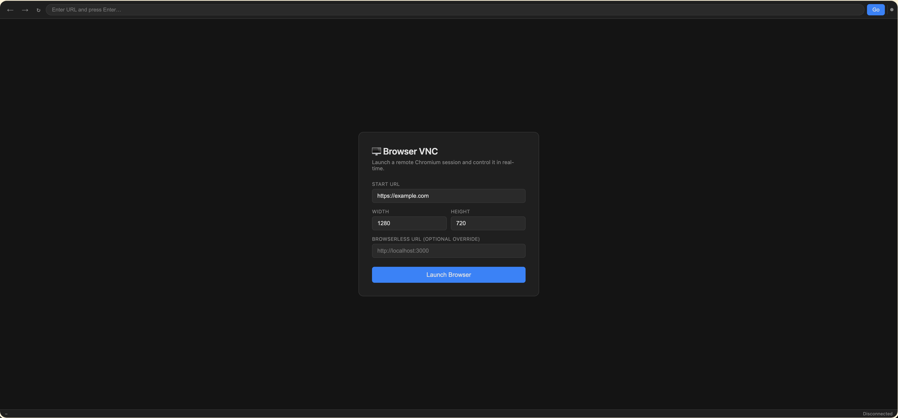
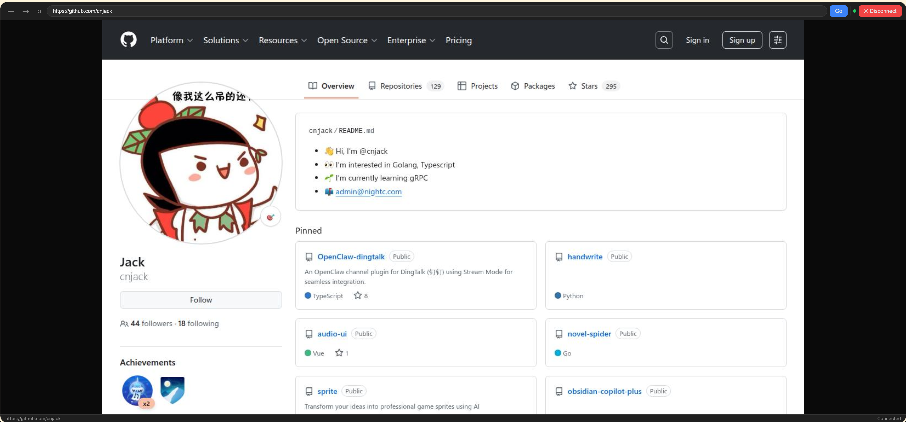

# Browserless Debugger

**Archived, moved to [https://github.com/cnjack/jbrowser](https://github.com/cnjack/jbrowser)**

[](https://github.com/cnjack/browserless-debugger)

A VNC-style browser remote-control tool built on **Python (FastAPI)** and **Chrome DevTools Protocol (CDP)**. It works with direct Chrome/Chromium CDP endpoints and still supports **[Browserless](https://github.com/browserless/browserless)**.  
Stream a live headless browser to any web client — no browser extension or desktop app required.





## Features

- **Live frame streaming** — pushes JPEG frames over WebSocket via `Page.startScreencast`
- **Mouse control** — move, click, right-click, double-click, scroll wheel
- **Keyboard control** — key press/release, text input, modifier keys (Ctrl / Alt / Shift / Meta)
- **URL navigation** — address bar, back, forward, reload
- **Multi-client** — multiple browsers can watch and control the same session simultaneously
- **Resizable viewport** — change resolution at runtime

---

## Architecture

```
Web Client (Canvas)
    ↕  WebSocket  (JPEG frames + input events)
Python FastAPI server (main.py)
    ↕  CDP over WebSocket
CDP-compatible Chromium / Chrome
```

---

## Quick Start

### Option 1 — Docker Compose (recommended)

```bash
docker compose up --build
```

Then open http://localhost:8080 in your browser.

### Option 2 — Local development

**1. Start a CDP-compatible browser**

```bash
google-chrome --headless=new --remote-debugging-address=127.0.0.1 --remote-debugging-port=18800 --disable-gpu about:blank
# or
chromium --headless=new --remote-debugging-address=127.0.0.1 --remote-debugging-port=18800 --disable-gpu about:blank
```

If you prefer Browserless, point `cdpUrl` or `CDP_URL` at that service instead.

**2. Install Python dependencies**

```bash
pip install uv
uv sync
```

**3. Start the API server**

```bash
uv run main.py
# or with hot-reload
uvicorn main:app --reload --port 8080
```

**4. Open the web UI**

Visit http://localhost:8080, enter a target URL, and click **Launch Browser**.

---

## REST API

| Method | Path | Description |
|--------|------|-------------|
| `POST` | `/api/sessions` | Create a new browser session |
| `GET` | `/api/sessions` | List all active sessions |
| `DELETE` | `/api/sessions/{id}` | Close a session |
| `WS` | `/ws/{id}` | Live frame stream + input control |

**POST /api/sessions — request body:**

```json
{
  "url": "https://example.com",
  "width": 1280,
  "height": 720,
  "cdpUrl": "http://127.0.0.1:18800"
}
```

**Response:**

```json
{
  "session_id": "abc-123",
  "ws_url": "/ws/abc-123",
  "viewer_url": "/?session=abc-123"
}
```

---

## WebSocket Protocol

### Server → Client

| Type | Fields | Description |
|------|--------|-------------|
| `frame` | `data` (base64 JPEG), `format`, `url`, `loading` | Live browser frame |
| `navigate` | `url` | URL changed |
| `loading` | — | Page started loading |
| `loaded` | — | Page finished loading |

### Client → Server

| Type | Fields | Description |
|------|--------|-------------|
| `navigate` | `url` | Navigate to URL |
| `back` / `forward` / `reload` | — | Browser history controls |
| `mousemove` | `x`, `y`, `modifiers` | Mouse move |
| `mousedown` | `x`, `y`, `button`, `clickCount`, `modifiers` | Mouse button down |
| `mouseup` | `x`, `y`, `button`, `clickCount`, `modifiers` | Mouse button up |
| `wheel` | `x`, `y`, `deltaX`, `deltaY`, `modifiers` | Scroll wheel |
| `keydown` | `key`, `code`, `text`, `modifiers`, `keyCode` | Key press |
| `keyup` | `key`, `code`, `modifiers`, `keyCode` | Key release |
| `char` | `text`, `modifiers` | Character input (text fields) |
| `resize` | `width`, `height` | Resize viewport |

> **Modifier bitmask**: Alt = 1, Ctrl = 2, Meta/Cmd = 4, Shift = 8

---

## Environment Variables

| Variable | Default | Description |
|----------|---------|-------------|
| `CDP_URL` | `http://127.0.0.1:18800` | CDP HTTP endpoint used to create or attach to browser targets |
| `HOST` | `0.0.0.0` | Server bind address |
| `PORT` | `8080` | Server port |

`BROWSERLESS_URL` is still accepted as a legacy alias for compatibility.

---

## Project Structure

```
browerless-debugger/
├── main.py           # FastAPI app — REST API + WebSocket endpoints
├── browser.py        # BrowserSession — CDP connection & frame streaming
├── cdp_client.py     # Chrome DevTools Protocol WebSocket client
├── pyproject.toml
├── Dockerfile
├── docker-compose.yml
└── static/
    └── index.html    # Web VNC viewer (Canvas + event capture)
```

---

## Security Notice

This service has **no authentication** and is intended for local development or trusted internal networks only.  
For production use, place a reverse proxy (Nginx / Caddy) in front with HTTPS and an auth layer. If you are using Browserless as the backing CDP service, also configure the `TOKEN` environment variable on the Browserless container.
